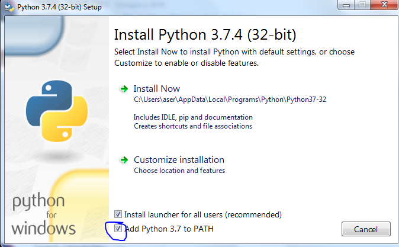

# python-tutorial

## Важные ссылки

* [Скачать Python для Windows 64-bit](https://www.python.org/ftp/python/3.7.4/python-3.7.4-amd64.exe) (рекомендуется)
* [Скачать Python для Windows 32-bit](https://www.python.org/ftp/python/3.7.4/python-3.7.4.exe) (если 64-бит не работает)
* Во время установки Python нужно не забыть нажать галочку *Add Python 3.7 to PATH*!

## Установка и запуск Jupyter Notebook

*Все последующие инструкции только для Windows*

1. Открыть командную строку (нажать Win+R, ввести cmd, нажать Enter)
2. Ввести `pip install jupyter` (только один раз, при установке)
3. Ввести `jupyter notebook`
4. Если в браузере не открылось окно с Jupyter, скопировать ссылку вида *http://127.0.0.1:8888/?token=...* и вставить в браузер
5. Если скопировать текст из командной строки нельзя
  1. Закрыть Jupyter, дважды нажав Ctrl+C
  2. Ввести `jupyter notebook --generate-config`
  3. Ввести `jupyter notebook password` и затем дважды ввести какой-нибудь пароль
  4. Ввести `jupyter notebook`
  6. Открыть в браузере *127.0.0.1:8888* и вписать свой пароль
6. Открыть файл ноутбука формата .ipynb
6. Успех!